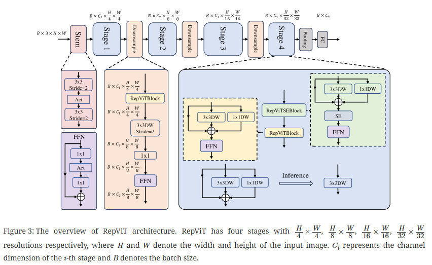
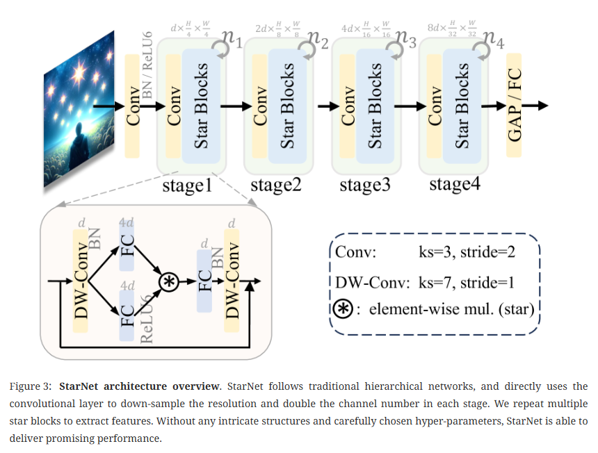
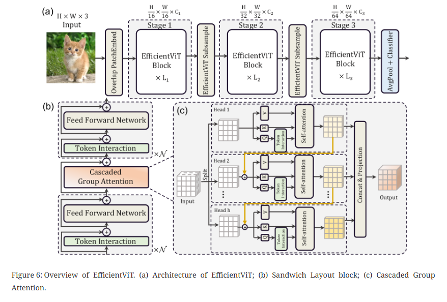
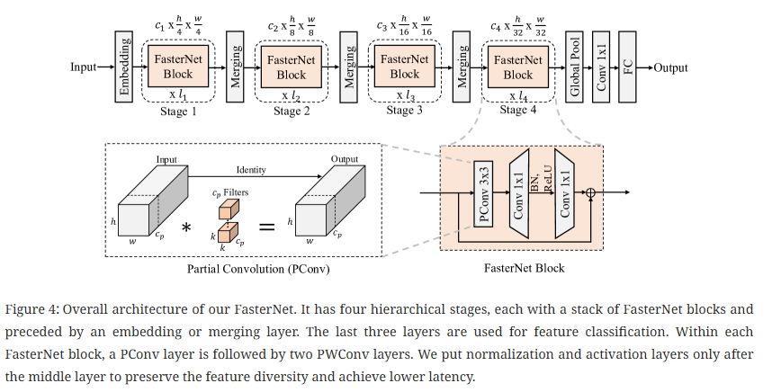
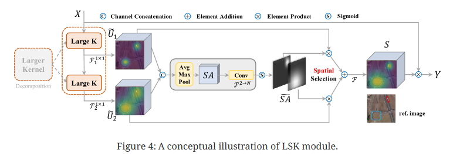
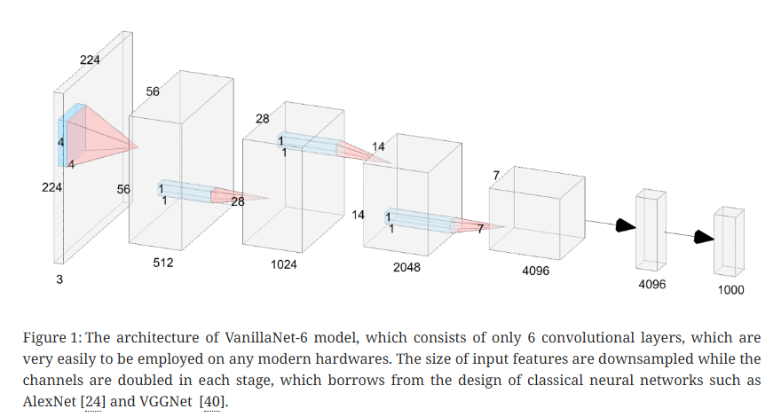
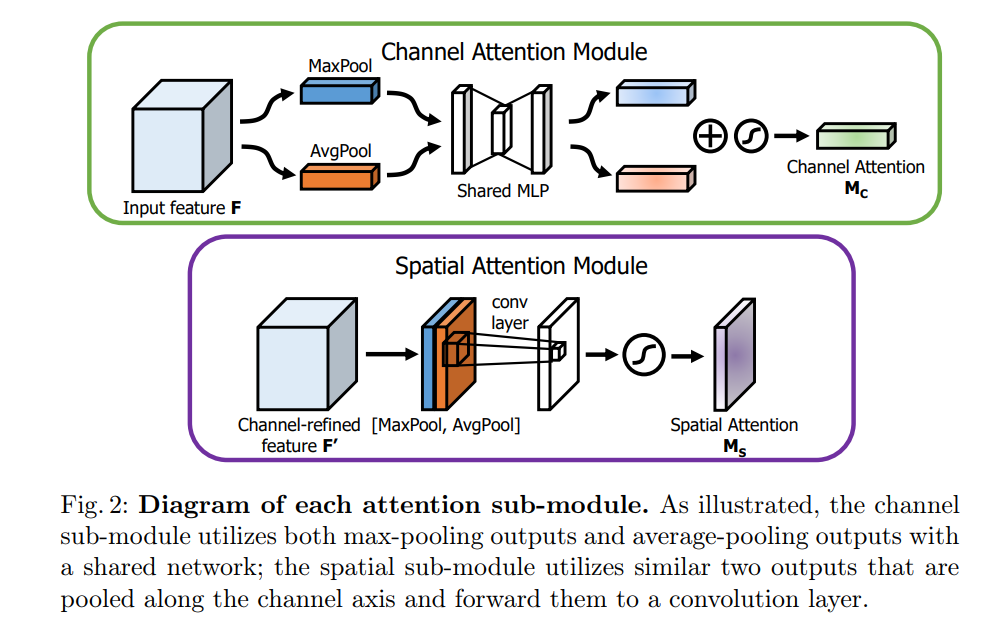
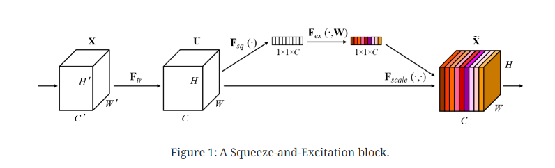
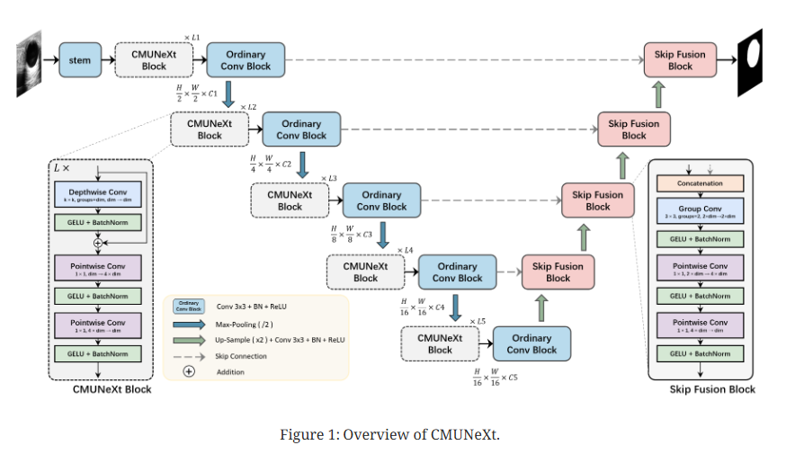

# YoLo Master


## Hacking YoLo with ultralytics

### プロジェクト構造
```
.
├── C1 バックボーン（Backbone）
│   ├── 1-RepViT
│   ├── 10-CSwinTransformer
│   ├── 2-Starnet
│   ├── 3-EfficientViT
│   ├── 4-FasterNet
│   ├── 5-ConvNeXtV2
│   ├── 6-EfficientFormerV2
│   ├── 7-LSKNet
│   ├── 8-SwinTransformer
│   └── 9-VanillaNet
├── C2 ネック（Neck）
│   └── 1-GFPN
├── C3 ヘッド（Head）
│   └── 1-DyHead
├── C4 アテンションメカニズム（Attention）
│   ├── 1-CBAM
│   ├── 2-SE
│   └── アテンションメカニズム使用説明.md
├── C6 その他
│   ├── アップサンプリング・ダウンサンプリングモジュール
│   └── 畳み込みモジュール
├── Images
└── README.md
```


### 飛書チュートリアル

- [YOLOシリーズカスタマイズチュートリアル](https://wvet00aj34c.feishu.cn/docx/RXJKdo5ZJoT5QPxiV3vcpGPwnzX?from=from_copylink)


###  本章参考資料


## 更新ログ


1. 2024-12-28 更新

     **C1 バックボーン（Backbone）**：複数のプラグアンドプレイバックボーンネットワークモジュールを新たに追加

    （1）**RepViT (CVPR 2024)**

     

    著者：Ao Wang, Hui Chen, Zijia Lin, Jungong Han, Guiguang Ding

    チーム：Tsinghua University; BNRist; The University of Sheffield
    
    論文URL：https://arxiv.org/pdf/2307.09283v8
    
    コードURL：https://github.com/THU-MIG/RepViT

    （2）**StarNet (CVPR 2024)**

     

    著者：Xu Ma, Xiyang Dai, Yue Bai, Yizhou Wang, Yun Fu

    チーム：Northeastern University; Microsoft

    論文URL：https://arxiv.org/pdf/2403.19967
    
    コードURL：https://github.com/ma-xu/Rewrite-the-Stars


    （3）**EfficientViT (CVPR 2023)**

     
     
    著者：Xinyu Liu, Houwen Peng, Ningxin Zheng, Yuqing Yang, Han Hu, Yixuan Yuan

    チーム：The Chinese University of Hong Kong; Microsoft Research

    論文URL：https://arxiv.org/pdf/2305.07027
    
    コードURL：https://github.com/mit-han-lab/efficientvit


    （4）**FasterNet (CVPR 2023)**
    
    

    著者：Jierun Chen, Shiu-hong Kao, Hao He, Weipeng Zhuo, Song Wen, Chul-Ho Lee, S.-H. Gary Chan

    チーム：HKUST; Rutgers University; Texas State University

    論文URL：https://arxiv.org/pdf/2303.03667v3
    
    コードURL：https://github.com/JierunChen/FasterNet
   

    （5）**ConvNeXt V2**

     

    著者：Sanghyun Woo, Shoubhik Debnath, Ronghang Hu, Xinlei Chen, Zhuang Liu, In So Kweon, Saining Xie

    チーム：KAIST; Meta AI, FAIR; New York University
    
    論文URL：https://arxiv.org/pdf/2301.00808
    
    コードURL：https://github.com/facebookresearch/ConvNeXt-V2

    （6）**Efficient Former V2 (ICCV 2023)**

     

    著者：Yanyu Li, Geng Yuan, Yang Wen, Ju Hu, Georgios Evangelidis, Sergey Tulyakov, Yanzhi Wang, Jian Ren

    チーム：Snap Inc; Northeastern University

    論文URL：https://arxiv.org/pdf/2203.03952
    
    コードURL：https://github.com/snap-research/EfficientFormer
    

    （7）**LSKNet (IJCV 2024 & ICCV 2023)**

     

    著者：Yuxuan Li, Xiang Li, Yimian Dai, Qibin Hou, Li Liu, Yongxiang Liu, Ming-Ming Cheng, Jian Yang

    チーム：VCIP, CS, Nankai University; Academy of Advanced Technology Research of Hunan; NKIARI, Futian
    
    論文URL：https://arxiv.org/pdf/2403.11735
    
    コードURL：https://github.com/zcablii/LSKNet
    
    
    （8）**Swin Transformer**

     

    著者：Ze Liu, Yutong Lin, Yue Cao, Han Hu, Yixuan Wei, Zheng Zhang, Stephen Lin, Baining Guo

    チーム：Microsoft Research Asia
    
    論文URL：https://arxiv.org/pdf/2103.14030
    
    コードURL：https://github.com/microsoft/Swin-Transformer
     

2. 2025-1-5 更新

     **C1 バックボーン（Backbone）**：複数のプラグアンドプレイバックボーンネットワークモジュールを新たに追加

    （1）**VanillaNet**

    

    著者：Hanting Chen, Yunhe Wang, Jianyuan Guo, Dacheng Tao

    チーム：Huawei Noah’s Ark Lab; School of Computer Science, University of Sydney
    
    論文URL：https://arxiv.org/pdf/2305.12972v2
    
    コードURL：https://github.com/huawei-noah/VanillaNet
    
    （2）**CSwin Transformer (CVPR 2022)**

     

    著者：Xiaoyi Dong, Jianmin Bao, Dongdong Chen, Weiming Zhang, Nenghai Yu, Lu Yuan, Dong Chen, Baining Guo

    チーム：University of Science and Technology of China; Microsoft Research Asia ;Microsoft Cloud + AI

    論文URL：https://arxiv.org/pdf/2107.00652
    
    コードURL：https://github.com/microsoft/CSWin-Transformer

    **C2 ネック（Neck）**：プラグアンドプレイネックネットワークモジュールを新たに追加

    （1）**GFPN (DEMO-YOLO)**
    
    

    著者：Xianzhe Xu, Yiqi Jiang, Weihua Chen, Yilun Huang, Yuan Zhang, Xiuyu Sun

    チーム：Alibaba Group

    論文URL：https://arxiv.org/abs/2211.15444
    
    コードURL：https://github.com/tinyvision/damo-yolo
    
    **C3 ヘッド（Head）**：プラグアンドプレイヘッドネットワークモジュールを新たに追加

    （1）**DynamicHead（DyHead）**

     .png)
     
    著者：Xiyang Dai, Yinpeng Chen, Bin Xiao, Dongdong Chen, Mengchen Liu, Lu Yuan, Lei Zhang

    チーム：Microsoft Redmond

    論文URL：https://arxiv.org/abs/2106.08322
    
    コードURL：https://github.com/microsoft/DynamicHead

    **C4 アテンションメカニズム（Attention）**：複数のプラグアンドプレイアテンションメカニズムネットワークモジュールを新たに追加

    （1）**CBAM**

     

    著者：Sanghyun Woo, Jongchan Park, Joon-Young Lee, In So Kweon

    チーム：Korea Advanced Institute of Science and Technology; Lunit Inc.; Adobe Research

    論文URL：https://arxiv.org/abs/1807.06521

    （2）**SE**

     

    著者：Jie Hu, Li Shen, Samuel Albanie, Gang Sun, Enhua Wu

    チーム：State Key Laboratory of Computer Science, Institute of Software, Chinese Academy of Sciences; Faculty of Science and Technology & AI Center at University of Macau

    論文URL：https://arxiv.org/abs/1709.01507
    
    コードURL：https://github.com/hujie-frank/SENet

    **C6 その他**：アップサンプリング、ダウンサンプリング、畳み込みのプラグアンドプレイモジュールを新たに追加

    （1）**アップサンプリングモジュール EUCB（EMCAD）**

     

    著者：Md Mostafijur Rahman, Mustafa Munir, Radu Marculescu

    チーム：The University of Texas at Austin Austin

    論文URL：https://arxiv.org/abs/2405.06880
    
    コードURL：https://github.com/SLDGroup/EMCAD

    （2）**畳み込みモジュール C2f_CMUNeXtBlock（CMUNeXt）**

     

    著者：Fenghe Tang, Jianrui Ding, Lingtao Wang, Chunping Ning, S. Kevin Zhou

    チーム： School of Biomedical Engineering Division of Life Sciences University of Science and Technology of China (USTC); Center for Medical Imaging, Robotics, Analytic Computing and Learning (MIRACLE) Suzhou Institute for Advanced Research University of Science and Technology of China (USTC); Key Laboratory of Intelligent Information Processing Institute of Computing Technology Chinese Academy of Sciences (CAS);
    School of Computer Science and Technology, Harbin Institute of Technology; Ultrasound Department, The Affiliated Hospital of Qingdao University

    論文URL：https://arxiv.org/abs/2308.01239
    
    コードURL：https://github.com/FengheTan9/CMUNeXt