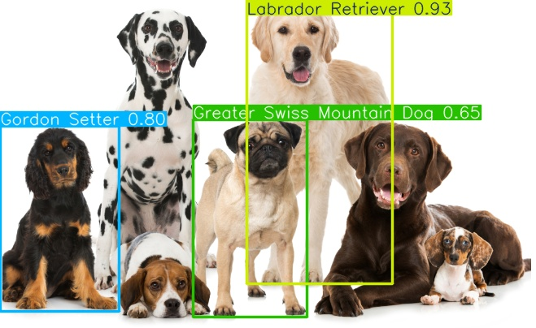
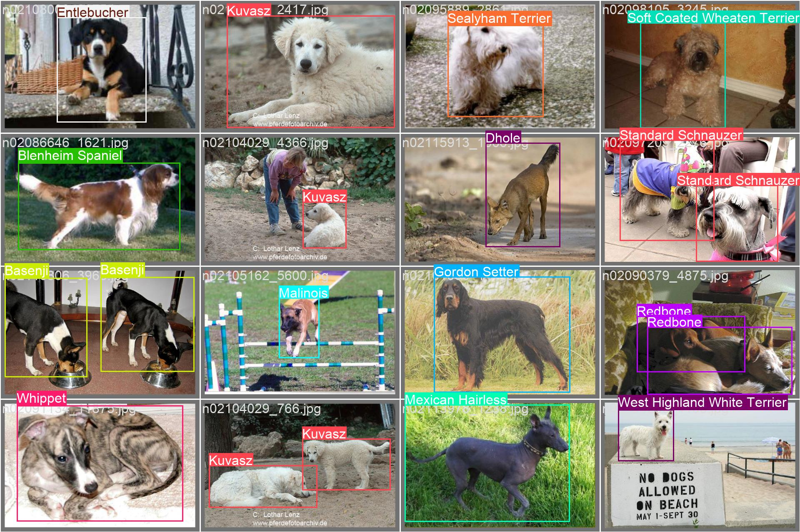

# labs-dog-breed-detection



このチュートリアルはデータセット処理の觓点から、ultralytics YOLOv8を使用して犬種検出の実戦プロジェクトを素早く始めることを支援するためのものです。

データセットは[**Stanford Dogs Dataset**](http://vision.stanford.edu/aditya86/ImageNetDogs/) 由来です (kaggleでもアップロード・整理されています、[リンク](https://www.kaggle.com/datasets/jessicali9530/stanford-dogs-dataset))。120種の犬種を含み、各品種ごとに100枚の画像があります。

## データセットコンテキスト
スタンフォード犬データセットは世界各地の120種の犬の画像を含んでいます。このデータセットはImageNetの画像とアノテーションを使用して構築され、細粒度画像分類タスクに使用されます。このデータセットは、一部の犬種がほぼ同一の特徴や色合い、年齢の違いを持つため、細粒度画像分類という挑戦的な問題を解決するために最初に収集されました。 



## データセットコンテンツ
- カテゴリ数：120 
- 画像数：20,580 
- アノテーション：カテゴリラベル、バウンディングボックス

## ファイル紹介

### ファイル構造
```
├── README.md
├── dog-breed-detection_kaggle.ipynb
├── dog-breed-detection_local.ipynb
├── runs
│   └── detect
│       └── predict4
│           ├── dogs1.jpg
│           └── dogs2.jpg
├── test_dogs
│   ├── dogs1.png
│   └── dogs2.png
└── yolov8m-v1
    ├── F1_curve.png
    ├── PR_curve.png
    ├── P_curve.png
    ├── R_curve.png
    ├── args.yaml
    ├── confusion_matrix.png
    ├── confusion_matrix_normalized.png
    ├── labels.jpg
    ├── labels_correlogram.jpg
    ├── results.csv
    ├── results.png
    ├── train_batch0.jpg
    ├── train_batch1.jpg
    ├── train_batch2.jpg
    ├── train_batch23250.jpg
    ├── train_batch23251.jpg
    ├── train_batch23252.jpg
    ├── val_batch0_labels.jpg
    ├── val_batch0_pred.jpg
    ├── val_batch1_labels.jpg
    ├── val_batch1_pred.jpg
    ├── val_batch2_labels.jpg
    ├── val_batch2_pred.jpg
    └── weights
        └── best.pt
```

- `dog-breed-detection_kaggle.ipynb` はkaggleプラットフォームのP100 GPU（16G）で訓練するためのnotebookです。kaggleのGPUリソースを使用する必要があります。修正後の[**dog-breed-detection-hong-fixed**](https://www.kaggle.com/code/chg0901/dog-breed-detection/notebook)を直接ご覧ください ([vineetmahajan/dog-breed-detection](https://www.kaggle.com/code/vineetmahajan/dog-breed-detection)から修正・調整したもので、元のファイルには環境問題があるため修正が必要でした)。

- **`dog-breed-detection_local.ipynb`** はローカルGPU（A6000 32G、マルチGPUでは若干の問題があるようで、計算リソースに応じてbatch sizeを調整できます）で訓練するためのnotebookです。ローカルGPUリソースとデータセットのダウンロードが必要です（notebookで全て提供されます）。上記のkaggle notebookから修正・調整したものです。

- **`yolov8m-v1`** は`dog-breed-detection_local.ipynb`で訓練したモデルのパスで、訓練過程中の重み、訓練結果などを含みます。
  - `yolov8m-v1/weights` は訓練済みのモデル重みで、`best.pt`のみ保存されています
  - `args.yaml` は訓練過程中のパラメータ記録です。
  - `results.csv` は訓練過程中の記録です。
  - `results.png` は訓練過程中の記録の可視化です。
  - `confusion_matrix.png`、`confusion_matrix_normalized.png` は訓練過程中の混同行列の可視化と正規化可視化です。
  - `labels.jpg`、`labels_correlogram.jpg` は訓練過程中のラベルとラベルのcorrelogramです。
  - `F1_curve.png`、`PR_curve.png`、`P_curve.png`、`R_curve.png` は訓練過程中のF1曲線、PR曲線、P曲線、R曲線です。
  - `train_batch0.jpg`、`train_batch1.jpg`、`train_batch2.jpg` は訓練過程中の訓練画像で、mosaicデータ拡張手法を使用しています。
  - `train_batch23250.jpg`、`train_batch23251.jpg`、`train_batch23252.jpg` は訓練過程中の訓練画像で、mosaicデータ拡張手法を使用していません。
  - `val_batch0_labels.jpg`、`val_batch1_labels.jpg`、`val_batch2_labels.jpg` は訓練過程中の検証画像のラベルです。
  - `val_batch0_pred.jpg`、`val_batch1_pred.jpg`、`val_batch2_pred.jpg` は訓練過程中の検証画像の予測値です。

- `test_dogs` はテスト画像で、モデルの効果をテストするためのものです。
  - `dogs1.jpg`と`dogs2.jpg`の2枚の画像を含みます
  
- `runs` はテスト画像の予測結果です
  - `runs/detect/predict4` には`test_dogs`内の`dogs1.jpg`と`dogs2.jpg`の予測結果が保存されています。`4`は予測時のindexです。  


## 0. 環境準備 [todo]

## 1. データセット準備

## 2. モデル訓練

## 3. モデル推論

## 4. モデル評価
5. モデルデプロイ