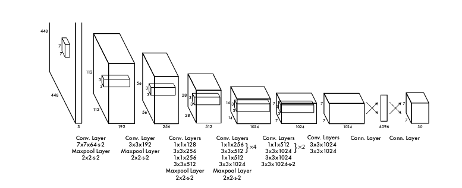
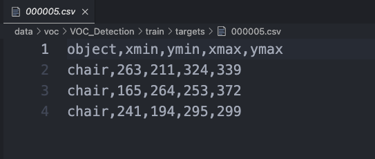

# YoLo Master

## YOLO Models from Scratch

本プロジェクトは**手動でYOLOモデルを実装する**方式で、**小規模データセット上でYOLOアルゴリズムを再現**することを目的としています。現在の計画ではYOLO [**V1**](../v1/YOLOv1.ipynb)、[**V3**](../v3/YOLOv3.ipynb)、[**V5**](../v5/YOLOv5.ipynb)、V8などを手動で実装する予定です。

まず共用可能なデータパイプライン(**`dataset`**、**`dataloader`**)を作成し、最終的に**Pytorch**ベースの統一されたシンプルなアルゴリズムインターフェースを採用し、主要な汎用データセットでの精度アライメントを実行する計画です。

興味とコンピューティングリソースをお持ちの方の参加を歓迎し、一緒にYOLOモデルを手動で実装しましょう！！

## YOLO v1: ゼロからのPyTorch実装
本リポジトリは論文 [You Only Look Once: Unified, Real-Time Object Detection](https://arxiv.org/abs/1506.02640) の内容をPyTorchで実装しています。コードは [Darknet](https://github.com/pjreddie/darknet) リポジトリの公式実装に従い、論文と比較していくつかの細かな違いがあります：

- 最も重要な違いはモデルのアーキテクチャです。具体的には、最初の全結合層が局所接続層に置き換えられています。論文では、YOLOモデルのアーキテクチャは以下の通りです：
<p align="center" width="100%">  </p>

- 各畳み込み層で、畳み込み操作後かつ活性化関数前にバッチ正規化操作を使用しています。
- 学習率スケジューリングとネットワーク訓練の最大バッチ数。

本リポジトリは論文の内容をゼロから実装しており、以下を含みます：
+ VOC訓練セット（train/val 2007 + train/val 2012）を使用した訓練、および
+ VOCテストセット（test 2007）を使用した評価

### 完了部分
1. VOCデータセットインポート完了
2. 各モジュールのコード記述とネットワーク構造の接続

### 改善が必要な部分
1. COCOデータセットへの適応が必要


### 安装环境
```
pip install -r requirements.txt
```


### データセット準備
#### PASCAL VOC 2007 + PASCAL VOC 2012 データセット
VOCデータセットをダウンロードして準備するには、以下の順序でスクリプトを実行してください：

```
# データセットを`./data/voc`にダウンロードして解凍
python scripts/download_voc.py ./data/voc 
# データセットをフォルダに分割して保存
python scripts/organize_voc.py ./data/voc
# .xml形式のターゲット注釈ファイルを.csv形式に変換
python scripts/simplify_voc_targets.py ./data/voc
```


小規模データセットでの訓練が必要な場合（オプション）
- --source_vocは完全なvoc元データのパスを表します
- --target_vocはフィルタリング後の小規模データセット保存パスを表します
- --classesはフィルタリングが必要なラベルを英語のカンマで区切って表します、例：car,person,bus
```
python scripts/toy_voc.py --source_voc ./data/voc/VOC_Detection --target_voc ./data/voc/small_voc --classes car,person,bus
```

データ変換後のcsvは以下の図のようになります：




### モデルダウンロード

[modelscope yolo_master/yolov1](https://modelscope.cn/models/yolo_master/yolov1/files) から事前訓練モデル`pretrained_model_weights.pt`と本プロジェクトで訓練済みのモデル`trained_model_weights.pt`をダウンロードできます。

`configs.py`で重みファイルのパスを設定できます。
```python
PRETRAINED_MODEL_WEIGHTS = "checkpoints/pretrained_model_weights.pt"  # 事前訓練モデルの重みファイルパス。訓練済みモデルから重みを復元するために使用。
TRAINING_CHECKPOINT_PATH = "checkpoints/training_checkpoint.pt"  # 訓練過程中のチェックポイントパス。訓練中に一定ステップごとにモデルとオプティマイザの状態を保存。
TRAINED_MODEL_WEIGHTS = "checkpoints/trained_model_weights.pt"  # 最終的に訓練済みのモデル重み保存パス。
```


### [Notebook](./yolov1.ipynb)大纲


#### 訓練詳細

デフォルトのConfigを採用し、最初のepochは140s、156epochは約6h必要です。

batch_size=64でGPUメモリは約14G必要です。

```
訓練Epoch:   1%|          | 1/156 [02:20<6:02:08, 140.18s/epoch, 訓練損失=7.125, テスト損失=4.574, 現在学習率=0.000500, 所要時間=140.18s]
Epoch 1/156:
  訓練損失: 7.125, テスト損失: 4.574
  現在学習率: 0.000500
  本回訓練所要時間: 140.18s
```

#### 訓練結果

MAP(Mean Average Precision) = `79.4%`


