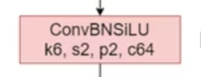
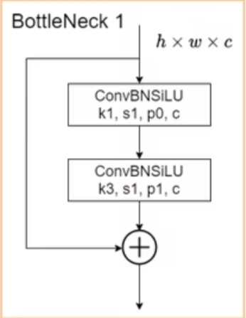
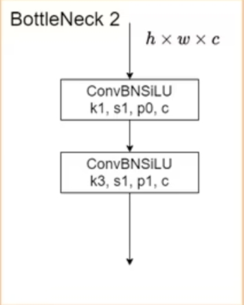
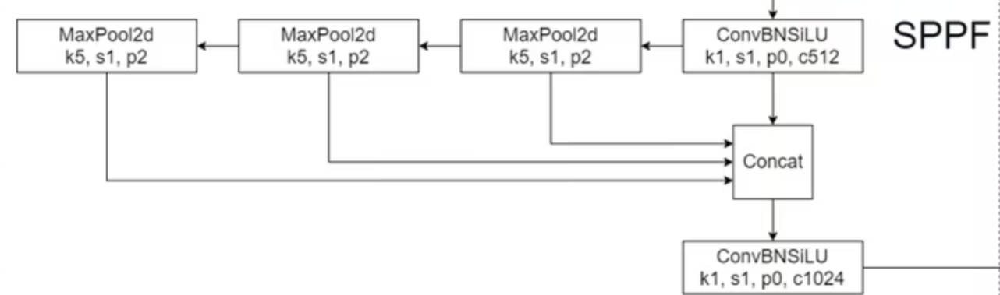

# YoLo Master

## YOLO Models from Scratch

本プロジェクトは**手動でYOLOモデルを実装する**方式で、**小規模データセット上でYOLOアルゴリズムを再現**することを目的としています。現在の計画ではYOLO [**V1**](../v1/YOLOv1.ipynb)、[**V3**](../v3/YOLOv3.ipynb)、[**V5**](../v5/YOLOv5.ipynb)、V8などを手動で実装する予定です。

まず共用可能なデータパイプライン(**`dataset`**、**`dataloader`**)を作成し、最終的に**Pytorch**ベースの統一されたシンプルなアルゴリズムインターフェースを採用し、主要な汎用データセットでの精度アライメントを実行する計画です。

興味とコンピューティングリソースをお持ちの方の参加を歓迎し、一緒にYOLOモデルを手動で実装しましょう！！

## YOLOV5 from Scratch コードファイル説明

コード貢献者：蔡鋆捷

### 完了部分
**1.** coco8データセットインポート完了

**2.** 各モジュールのコード記述とネットワーク構造の接続

### 改善が必要な部分
**1.** YOLOv5の損失関数の補完

**2.** trainとtestコードの補完（補完時にコンピュータのGPUメモリ問題に注意）

### 図の説明
**1.** 以下の図はConBNSiLUモジュールの構造図です

**2.** 以下の図はBottleNeck1モジュールの構造図です

**3.** 以下の図はBottleNeck2モジュールの構造図です

**4.** 以下の図はSPPFモジュールの構造図です

### その他の実践

[YOLO V3 from scratch Notebook](../v3/YOLOv3.ipynb) では使用するcoco8とcoco128データセットに対してより多くの**探索的データ分析(EDA)**を行っているので、優先的にご覧ください。
